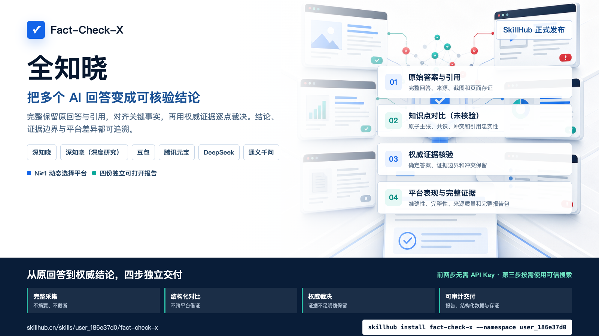

# Fact-Check-X

[中文](README.md) · [SkillHub](https://skillhub.cn/skills/user_186e37d0/fact-check-x) · [skills.sh](https://www.skills.sh/asi2030/fact-check-x/fact-check-x-complete) · [Awesome Skills](https://www.awesomeskills.dev/en/skill/fact-check-x-fact-check-x-complete) · [Agent-Skills.md](https://agent-skills.md/skills/ASI2030/Fact-Check-X/fact-check-x-complete) · [Releases](https://github.com/ASI2030/Fact-Check-X/releases) · [Security](SECURITY.md) · [Privacy](PRIVACY.md)

Compare complete answers and citations from several AI services, then verify atomic facts against authoritative evidence. Fact-Check-X makes each platform's answer, source support, disagreements and final finding traceable.

<p align="center">
  
</p>

## Quick start

```bash
skillhub install fact-check-x --namespace user_186e37d0
```

Install through the Agent Skills CLI:

```bash
npx skills add ASI2030/Fact-Check-X --skill fact-check-x-complete
```

The public listing is available on [skills.sh](https://www.skills.sh/asi2030/fact-check-x/fact-check-x-complete).

The complete skill is also indexed by [Awesome Skills](https://www.awesomeskills.dev/en/skill/fact-check-x-fact-check-x-complete) and [Agent-Skills.md](https://agent-skills.md/skills/ASI2030/Fact-Check-X/fact-check-x-complete). Both directories install from this repository's `fact-check-x-complete` source tree; a clean 94-file installation was verified against the release source before publication.

Claude Code users can install the repository as a versioned plugin marketplace:

```bash
claude plugin marketplace add ASI2030/Fact-Check-X
claude plugin install fact-check-x@fact-check-x-marketplace
```

Or download `fact-check-x-complete.zip` from [GitHub Releases](https://github.com/ASI2030/Fact-Check-X/releases) and install it in WorkBuddy, Codex, Claude Code or another Agent Skills-compatible host. Verify the download against the `SHA256SUMS` file from the same release.

Then ask naturally:

```text
Use Fact-Check-X to verify this question: ...
Platforms: DeepSeek, Qwen and Doubao.
```

## Officially supported platforms

| Platform ID | Name | Capture |
|---|---|---|
| `dknowc-chat` | DKnow Chat / 深知晓 | Standard answer, citations and official sources |
| `dknowc-deep-research` | DKnow Deep Research | Runs after the normal answer and is saved as a separate platform result |
| `doubao` | Doubao | Complete answer, citations and page evidence |
| `yuanbao` | Tencent Yuanbao | Complete answer, citations and page evidence |
| `deepseek` | DeepSeek | Complete answer, citations and page evidence |
| `qianwen` | Qwen | Complete answer, citations and page evidence |

The selected set is dynamic. `N=1` runs a complete single-platform verification. `N≥2` adds agreement, conflict and citation comparison. Platforms not listed here are not part of the current support commitment.

## Four independent deliverables

1. **Original answers and citations**: complete answers, references, screenshots and HTML evidence.
2. **Knowledge comparison (unverified)**: atomic facts, claims, agreements, conflicts and source faithfulness.
3. **Authoritative evidence verification**: evidence, findings, platform verdicts and explicit evidence boundaries.
4. **Platform performance and complete evidence**: accuracy, completeness, source quality and a portable report package.

Capture and comparison require no API key. Trusted Search is an optional enhancement used only at the authoritative verification stage. On first use, the user signs in to the DKnow MaaS page; the skill obtains or creates a dedicated local key without asking the user to paste secrets into chat. Semantic analysis runs in the current host and does not call an external model API.

### Deep Research is a separate platform result

`dknowc-deep-research` is not an alias or a longer wait:

1. submit the original question in the same authenticated session;
2. wait for the normal answer to finish;
3. invoke the Deep Research entry;
4. take over the newly opened provenance report;
5. wait for it to finish;
6. save its answer, sources, screenshot and page evidence separately.

A missing button, unopened report or incomplete result is a capture failure. Deep Research does not automatically inherit the trusted-anchor exemption reserved for a qualified `dknowc-chat` result.

## Requirements

- Python 3.10+
- Node.js 20+
- macOS, Windows or Linux
- Google Chrome, Microsoft Edge, Brave or Chromium
- authorized accounts for every selected website
- authorized 深知 MaaS access for non-exempt authority retrieval

Inside an extracted `fact-check-x-complete` skill:

```bash
cd modules/llm-answer-reference-compare/assets/tool
npm ci --omit=dev
cd ../../../..

python3 scripts/fact_check_x.py locate
```

The visible workflow prefers an installed system Chromium browser. Install Playwright's test browser only for headless or CI validation:

```bash
cd modules/llm-answer-reference-compare/assets/tool
npx playwright install chromium
cd ../../../..
```

## Installation

Download `fact-check-x-complete.zip` from [GitHub Releases](https://github.com/ASI2030/Fact-Check-X/releases). Verify it against the `SHA256SUMS` file published with the same release.

### WorkBuddy

Open **Skills → Add skill → Upload skill**, then upload `fact-check-x-complete.zip`.

The helper validates the archive and prints the manual upload instruction:

```bash
python3 scripts/install_skill.py \
  --source fact-check-x-complete.zip \
  --target workbuddy
```

Official reference: [WorkBuddy Skills](https://www.codebuddy.cn/docs/workbuddy/From-Beginner-to-Expert-Guide/Function-Description/Skills-Market)

### CodeBuddy

```bash
# User scope
python3 scripts/install_skill.py \
  --source fact-check-x-complete.zip \
  --target codebuddy

# Project scope
python3 scripts/install_skill.py \
  --source fact-check-x-complete.zip \
  --target codebuddy \
  --project-dir .
```

The destinations are `~/.codebuddy/skills/` and `.codebuddy/skills/`.

Official reference: [CodeBuddy Code Skills](https://www.codebuddy.cn/docs/cli/skills)

### Codex

```bash
python3 scripts/install_skill.py \
  --source fact-check-x-complete.zip \
  --target codex
```

The installer honors `CODEX_HOME`, defaulting to `~/.codex/skills/`. Start a new task or refresh skill discovery after installation.

Reference: [Using skills](https://openai.com/academy/skills/)

### Claude Code

```bash
# User scope
python3 scripts/install_skill.py \
  --source fact-check-x-complete.zip \
  --target claude-code

# Project scope
python3 scripts/install_skill.py \
  --source fact-check-x-complete.zip \
  --target claude-code \
  --project-dir .
```

The destinations are `~/.claude/skills/` and `.claude/skills/`.

Official reference: [Extend Claude with skills](https://code.claude.com/docs/en/slash-commands)

The installer rejects traversal paths, symlinks, runtime state and multi-root archives. It stops on collision; `--replace` moves the old skill to a timestamped backup before installing.

## Trusted Search Key

Never paste a Key into chat, an issue, a report or shell history.

### Getting a Key

Trusted Search Keys are provided by [DeepKnown MaaS](https://platform.dknowc.cn/):

1. If you already have a MaaS account, sign in through the [official login page](https://platform.dknowc.cn/auth/#/login), open API Key management and create a dedicated `Fact-Check-X` Key. Then run the automatic onboarding command below; the component will reuse the Key without requiring you to copy it manually.
2. If you do not yet have an account or Trusted Search access, visit the [DeepKnown product site](https://www.dknowc.cn/) and follow its **API access / beta participation** path. Account eligibility, quotas, service scope and review requirements are controlled by the current MaaS service.
3. Do not reuse a shared production Key. Create and revoke the Fact-Check-X Key independently and grant only the permissions it needs.

Fact-Check-X uses DeepKnown MaaS, built by Beijing Caizhi Technology, because it provides traceable knowledge search for regulations, public services and industry standards through API and MCP interfaces. MaaS retrieves candidate authoritative material; the host agent still decides whether that evidence supports each claim.

Before authority retrieval, Fact-Check-X checks the process environment, the shared credential file and whether all knowledge points have qualified anchors. If a non-exempt point exists without a valid Key, `prepare-authority` returns `configuration_required`, a user prompt and the exact configuration command.

Standard onboarding:

```bash
python3 scripts/trusted_search_config.py configure
```

The component opens the 深知 MaaS page, waits for the user to complete identity checks, reuses an existing complete Key or creates a dedicated `Fact-Check-X` Key, validates it, and stores it at:

`~/.fact-check-x/credentials/trusted-search-key`

Check status without displaying the Key:

```bash
python3 scripts/trusted_search_config.py status
```

Clear the shared credential:

```bash
python3 scripts/trusted_search_config.py clear
```

Only 401/403 invalidates an existing Key. A timeout, network failure or service error preserves it and moves the run to review.

## Playwright sessions and Computer Use recovery

Persistent browser state defaults to:

`~/.fact-check-x/browser-profiles`

Profiles reduce repeated login but never bypass login-state, ready-page, answer-completion or all-platform-success checks. `login` and `run` must execute in the foreground with their real exit status.

When automation cannot complete, `capture-recovery.json` records the selected platform, original question and recovery action. A host with Computer Use takes over the same visible page and profile, reuses the recorded question, lets the user handle password, SMS and CAPTCHA, waits for generation to stop, then reruns capture.

Do not replace this recovery with a headless browser, a new temporary profile, lock-file deletion or a partial-result shortcut. A host without Computer Use must stop at the original-answer capture stage.

## CLI example

```bash
FCX_QUESTION="What is the current rule for the policy in question?"
FCX_RUN_DIR="./fact-check-x-run"

node modules/llm-answer-reference-compare/assets/tool/dist/cli.js run \
  --question "$FCX_QUESTION" \
  --platform dknowc-chat \
  --platform dknowc-deep-research \
  --platform doubao \
  --out "$FCX_RUN_DIR/capture" \
  --headed \
  --interactive \
  --timeout 180000 \
  --retries 2

python3 scripts/fact_check_x.py prepare-comparison \
  --results "$FCX_RUN_DIR/capture/results.json" \
  --run-dir "$FCX_RUN_DIR"

# The current host agent writes comparison-analysis.json.

python3 scripts/fact_check_x.py complete-comparison \
  --results "$FCX_RUN_DIR/capture/results.json" \
  --run-dir "$FCX_RUN_DIR"

python3 scripts/fact_check_x.py prepare-authority \
  --run-dir "$FCX_RUN_DIR"

python3 scripts/fact_check_x.py search-authority \
  --run-dir "$FCX_RUN_DIR" \
  --max-workers 12

# The current host agent writes one assessment per knowledge point.

python3 scripts/fact_check_x.py finalize-authority \
  --run-dir "$FCX_RUN_DIR"

python3 scripts/fact_check_x.py deliver \
  --results "$FCX_RUN_DIR/capture/results.json" \
  --run-dir "$FCX_RUN_DIR"
```

Stop on every non-zero exit and read the structured error. Never hide an exit code with a background job or permissive shell wrapper.

## Output contract

The run directory contains:

```text
capture/results.json
capture/report.html
capture/report.md
capture-gate.json
comparison-task.json
comparison-analysis.json
comparison.json
comparison.html
comparison-gate.json
authority/requests/
authority/evidence/
authority/assessments/
authority/results/
authority-gate.json
verification.json
pipeline.json
01-capture-report.html
02-comparison-report.html
03-authority-report.html
04-final-report.html
05-complete-report-package.zip
```

The capture layer never rewrites an answer or replaces an original citation. The comparison layer never searches for final truth. The authority layer handles one atomic point per request. The final package is not produced unless all four reports exist, and it uses only relative paths.

## Configuration

| Variable | Purpose |
|---|---|
| `FACTCHECK_SKILLS_DIR` | Override the parent directory containing the four modules |
| `FACT_CHECK_X_BROWSER_EXECUTABLE` | Select a system Chromium executable |
| `FACTCHECK_BROWSER_PROFILE_DIR` | Override the persistent browser-profile root |
| `FACT_CHECK_X_TRUSTED_SEARCH_KEY_FILE` | Override the shared credential file |
| `TRUSTED_SEARCH_KEY` | Controlled process injection only; do not persist in chat or history |
| `FACTCHECK_TRUSTED_SEARCH_URL` | Controlled Trusted Search endpoint override |
| `FACTCHECK_TRUSTED_SEARCH_TIMEOUT_SECONDS` | Authority retrieval timeout |
| `CI` | Select CI browser behavior |

## Security and privacy

- Review every third-party Skill before enabling it.
- The question is sent only to platforms explicitly selected by the user.
- Authority retrieval sends one atomic point at a time.
- No external model API is called.
- Browser state and the Trusted Search Key remain in the local user profile.
- The repository and Release exclude profiles, Cookies, Keys, real sessions, real reports, caches and `node_modules`.
- Fact-Check-X adds no telemetry; selected services apply their own policies.

See [PRIVACY.md](PRIVACY.md) and [SECURITY.md](SECURITY.md).

## Troubleshooting

| Problem | Correct response |
|---|---|
| Modules cannot be located | Check the installation depth and `FACTCHECK_SKILLS_DIR` |
| `npm ci` fails | Use Node 20+, preserve lock integrity and check the selected registry |
| Browser does not open | Read the real foreground exit; do not claim it launched |
| Input box appears while still logged out | Wait until the login entry disappears |
| CAPTCHA or SMS challenge | Keep the page open and let the user complete it |
| One platform fails | Repair or recapture it; the capture gate must stay closed |
| `capture-recovery.json` appears | Use Computer Use on the same page or stop at original-answer capture |
| `configuration_required` | Run the returned configuration command in the foreground |
| Trusted Search times out | Preserve the Key and retry up to three times; if it still fails, stop with a technical error |
| `insufficient_evidence` | Keep the evidence boundary explicit, exclude it from deterministic answers and accuracy denominators, and continue to the fourth report |
| Local report link cannot be shared | Upload the report package or individual report files |

## Validation

```bash
python3 scripts/audit_public_tree.py
python3 -m unittest discover -s tests -p 'test_*.py'

python3 skills/llm-answer-reference-compare/tests/smoke_test.py
python3 skills/fact-check-x-knowledge-compare/tests/smoke_test.py
python3 skills/fact-check-x-authoritative-verify/tests/smoke_test.py
python3 skills/fact-check-x-unified/tests/smoke_test.py
python3 skills/fact-check-x-complete/tests/smoke_test.py
```

Build reproducible public assets:

```bash
FCX_RELEASE_OUT="./release-assets"
FCX_VERSION="<release version>"
FCX_CANDIDATE_SHA="<candidate complete-package SHA256>"
FCX_OFFICIAL_SHA="<official complete-package SHA256>"

python3 scripts/build_release.py \
  --out-dir "$FCX_RELEASE_OUT" \
  --version "$FCX_VERSION" \
  --upstream-candidate-sha "$FCX_CANDIDATE_SHA" \
  --official-complete-sha "$FCX_OFFICIAL_SHA"

python3 scripts/verify_release.py manifest \
  --manifest "$FCX_RELEASE_OUT/release-manifest.json" \
  --asset-dir "$FCX_RELEASE_OUT"
```

Builds remain `awaiting_promote` without an official SHA and fail closed when candidate and official SHA differ. Exact hashes for a published version are recorded in its `release-manifest.json` and `SHA256SUMS`.

## Version and SHA verification

Verify the formally promoted input:

```bash
python3 scripts/verify_release.py sha \
  --file fact-check-x-complete.zip \
  --sha256 <SHA256 published with the release>
```

Verify downloaded public assets:

```bash
python3 scripts/verify_release.py manifest \
  --manifest release-manifest.json \
  --asset-dir .
```

For an immutable GitHub Release:

```bash
gh release verify <tag> --repo ASI2030/Fact-Check-X
gh release verify-asset <tag> fact-check-x-complete.zip \
  --repo ASI2030/Fact-Check-X
gh attestation verify fact-check-x-complete.zip \
  --repo ASI2030/Fact-Check-X
```

`fact-check-x-complete.zip` is the formal installation baseline. Versioned module and suite ZIPs are deterministic distributions from the same public source tree and have independent hashes. `release-manifest.json` records both categories; their hashes must not be interchanged.

## Contributing and license

Original project code and documentation are licensed under [Apache-2.0](LICENSE). The existing MIT license for the `llm-answer-reference-compare` runtime is preserved. See [THIRD_PARTY_NOTICES.md](THIRD_PARTY_NOTICES.md).

Apache-2.0 does not grant project-brand or third-party trademark rights. See [TRADEMARKS.md](TRADEMARKS.md).

Before contributing, read [CONTRIBUTING.md](CONTRIBUTING.md). Public issues, pull requests, fixtures and screenshots must use synthetic or explicitly authorized data.
