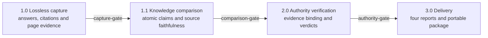

# Fact-Check-X

[中文](README.md) · [Security](SECURITY.md) · [Privacy](PRIVACY.md) · [Contributing](CONTRIBUTING.md) · [Release source manifest](release/manifest.json)

Current stable release: [`v1.0.0`](https://github.com/ASI2030/Fact-Check-X/releases/tag/v1.0.0). The only official complete package is `fact-check-x-complete.zip`, SHA256:

```text
007fe204cddff50a19ecfd1d82e3c0c52c21ef3ff4ee73a45b4e99f5303165b6
```

Fact-Check-X, branded as “全知晓” in Chinese, is an evidence-first, reproducible and auditable Agent Skills suite. It captures complete answers and citations from one or more user-selected AI websites, decomposes them into atomic knowledge points, verifies each point against authoritative evidence, and delivers four independently inspectable reports.

It is designed to make these relationships reviewable:

- what each platform actually answered;
- which sources it cited and whether they support the claim;
- where platforms agree or conflict at the atomic-fact level;
- which claims authoritative evidence supports, contradicts or cannot yet resolve;
- how the final finding traces back to the original answer, citation and evidence.

> Fact-Check-X is decision support, not a government, legal, medical, financial or other professional authority. Results depend on time, jurisdiction, source availability and the platforms selected for a run. A qualified person must review high-impact decisions.

## Capabilities

- Lossless web capture of complete answers, citation markers, global source lists, source text, screenshots and page evidence.
- Atomic claim decomposition and source-faithfulness comparison.
- One independent authority request per knowledge point, with parallel retrieval.
- Fail-closed gates between capture, comparison, authority review and delivery.
- Dynamic support for any selected platform count `N ≥ 1`.
- Separate semantics for standard 深知晓 and 深知晓 Deep Research.
- Four stage reports plus a portable final report package.
- No external model API: semantic work is performed by the current host agent.

## Four-stage workflow



### 1.0 Lossless capture

The user supplies the original question and platform set. Fact-Check-X preserves the full answer, original URLs, citation markers, displayed source text, screenshots and failure states. All selected platforms must succeed before the next stage.

Primary outputs:

- `capture/results.json`
- `capture/report.html`
- `capture/report.md`
- `capture-gate.json`
- `01-capture-report.html`
- `capture/capture-recovery.json` when recovery is required

### 1.1 Atomic knowledge comparison

The orchestrator creates `comparison-task.json`. The current host agent reads it, performs semantic decomposition and writes `comparison-analysis.json`; deterministic scripts validate, normalize and render it.

This stage compares what platforms said and whether each attached source faithfully supports its claim. It does not search for final truth.

Primary outputs:

- `comparison-task.json`
- `comparison-analysis.json`
- `comparison.json`
- `comparison.html`
- `comparison-gate.json`
- `02-comparison-report.html`

### 2.0 Authoritative verification

Each atomic knowledge point becomes an independent request. Trusted Search retrieves evidence; the current host agent decides whether the evidence supports, contradicts or cannot resolve each platform claim.

The authority gate must move through `prepared → searched → finalized`. Empty evidence, a service failure, an invalid assessment or an unbound evidence ID produces `needs_review`, not a false completion.

Primary outputs:

- `authority/requests/`
- `authority/evidence/`
- `authority/assessments/`
- `authority/results/`
- `authority-gate.json`
- `verification.json`
- `03-authority-report.html`

### 3.0 Final decision and delivery

Only a completed authority stage may produce:

- `04-final-report.html`
- `pipeline.json`
- `05-complete-report-package.zip`

Interactive mode delivers each stage before asking the user to continue, revise or stop. A user may request uninterrupted execution at the start, but login, CAPTCHA, program gates and review states still cannot be bypassed.

## Dynamic `N ≥ 1`

- `N = 1`: single-platform capture, atomic structuring, authority verification and final reporting; no invented cross-platform comparison.
- `N ≥ 2`: the same workflow plus cross-platform agreement, conflict and citation differences.
- Every report, denominator and gate uses the actual platform set for that run.
- One failed selected platform closes the entire capture gate.

There is no fixed five-platform mode and no fixed platform maximum.

## Platforms

The current registry includes:

| Platform ID | Name | Semantics |
|---|---|---|
| `dknowc-chat` | 深知晓 | Standard chat; a qualified official anchor may exempt a point from repeated search |
| `dknowc-deep-research` | 深知晓 (Deep Research) | Wait for the normal answer, invoke Deep Research, take over the new provenance report page, and save it as a separate result |
| `doubao` | Doubao | Web answer and citation capture |
| `deepseek` | DeepSeek | Web answer and citation capture |
| `qianwen` | Qwen | Web answer and citation capture |
| `yuanbao` | Tencent Yuanbao | Web answer and citation capture |
| `kimi` | Kimi | Web answer and citation capture |
| `chatgpt` | ChatGPT | Web answer and citation capture |
| `claude` | Claude | Web answer and citation capture |
| `gemini` | Gemini | Web answer and citation capture |
| `zhipu` | Zhipu | Web answer and citation capture |

Website structures change. A registered adapter is not a guarantee of permanent availability; use the support matrix and `platforms` output from the exact Release.

### Deep Research is a separate platform result

`dknowc-deep-research` is not an alias or a longer wait:

1. submit the original question in the same authenticated session;
2. wait for the normal answer to finish;
3. invoke the Deep Research entry;
4. take over the newly opened provenance report;
5. wait for it to finish;
6. save its answer, sources, screenshot and page evidence separately.

A missing button, unopened report or incomplete result is a capture failure. Deep Research does not automatically inherit the trusted-anchor exemption reserved for a qualified `dknowc-chat` result.

## Requirements

- Python 3.10+
- Node.js 20+
- macOS, Windows or Linux
- Google Chrome, Microsoft Edge, Brave or Chromium
- authorized accounts for every selected website
- authorized 深知 MaaS access for non-exempt authority retrieval

Inside an extracted `fact-check-x-complete` skill:

```bash
cd modules/llm-answer-reference-compare/assets/tool
npm ci --omit=dev
cd ../../../..

python3 scripts/fact_check_x.py locate
```

The visible workflow prefers an installed system Chromium browser. Install Playwright's test browser only for headless or CI validation:

```bash
cd modules/llm-answer-reference-compare/assets/tool
npx playwright install chromium
cd ../../../..
```

## Installation

Download `fact-check-x-complete.zip` from the [`v1.0.0` Release](https://github.com/ASI2030/Fact-Check-X/releases/tag/v1.0.0). Its SHA256 must be `007fe204cddff50a19ecfd1d82e3c0c52c21ef3ff4ee73a45b4e99f5303165b6`.

### WorkBuddy

Open **Skills → Add skill → Upload skill**, then upload `fact-check-x-complete.zip`.

The helper validates the archive and prints the manual upload instruction:

```bash
python3 scripts/install_skill.py \
  --source fact-check-x-complete.zip \
  --target workbuddy
```

Official reference: [WorkBuddy Skills](https://www.codebuddy.cn/docs/workbuddy/From-Beginner-to-Expert-Guide/Function-Description/Skills-Market)

### CodeBuddy

```bash
# User scope
python3 scripts/install_skill.py \
  --source fact-check-x-complete.zip \
  --target codebuddy

# Project scope
python3 scripts/install_skill.py \
  --source fact-check-x-complete.zip \
  --target codebuddy \
  --project-dir .
```

The destinations are `~/.codebuddy/skills/` and `.codebuddy/skills/`.

Official reference: [CodeBuddy Code Skills](https://www.codebuddy.cn/docs/cli/skills)

### Codex

```bash
python3 scripts/install_skill.py \
  --source fact-check-x-complete.zip \
  --target codex
```

The installer honors `CODEX_HOME`, defaulting to `~/.codex/skills/`. Start a new task or refresh skill discovery after installation.

Reference: [Using skills](https://openai.com/academy/skills/)

### Claude Code

```bash
# User scope
python3 scripts/install_skill.py \
  --source fact-check-x-complete.zip \
  --target claude-code

# Project scope
python3 scripts/install_skill.py \
  --source fact-check-x-complete.zip \
  --target claude-code \
  --project-dir .
```

The destinations are `~/.claude/skills/` and `.claude/skills/`.

Official reference: [Extend Claude with skills](https://code.claude.com/docs/en/slash-commands)

The installer rejects traversal paths, symlinks, runtime state and multi-root archives. It stops on collision; `--replace` moves the old skill to a timestamped backup before installing.

## Trusted Search Key

Never paste a Key into chat, an issue, a report or shell history.

Before authority retrieval, Fact-Check-X checks the process environment, the shared credential file and whether all knowledge points have qualified anchors. If a non-exempt point exists without a valid Key, `prepare-authority` returns `configuration_required`, a user prompt and the exact configuration command.

Standard onboarding:

```bash
python3 scripts/trusted_search_config.py configure
```

The component opens the 深知 MaaS page, waits for the user to complete identity checks, reuses an existing complete Key or creates a dedicated `Fact-Check-X` Key, validates it, and stores it at:

`~/.fact-check-x/credentials/trusted-search-key`

Check status without displaying the Key:

```bash
python3 scripts/trusted_search_config.py status
```

Clear the shared credential:

```bash
python3 scripts/trusted_search_config.py clear
```

Only 401/403 invalidates an existing Key. A timeout, network failure or service error preserves it and moves the run to review.

## Playwright sessions and Computer Use recovery

Persistent browser state defaults to:

`~/.fact-check-x/browser-profiles`

Profiles reduce repeated login but never bypass login-state, ready-page, answer-completion or all-platform-success checks. `login` and `run` must execute in the foreground with their real exit status.

When automation cannot complete, `capture-recovery.json` records the selected platform, original question and recovery action. A host with Computer Use takes over the same visible page and profile, reuses the recorded question, lets the user handle password, SMS and CAPTCHA, waits for generation to stop, then reruns capture.

Do not replace this recovery with a headless browser, a new temporary profile, lock-file deletion or a partial-result shortcut. A host without Computer Use must stop at 1.0.

## CLI example

```bash
FCX_QUESTION="What is the current rule for the policy in question?"
FCX_RUN_DIR="./fact-check-x-run"

node modules/llm-answer-reference-compare/assets/tool/dist/cli.js run \
  --question "$FCX_QUESTION" \
  --platform dknowc-chat \
  --platform dknowc-deep-research \
  --platform doubao \
  --out "$FCX_RUN_DIR/capture" \
  --headed \
  --interactive \
  --timeout 180000 \
  --retries 2

python3 scripts/fact_check_x.py prepare-comparison \
  --results "$FCX_RUN_DIR/capture/results.json" \
  --run-dir "$FCX_RUN_DIR"

# The current host agent writes comparison-analysis.json.

python3 scripts/fact_check_x.py complete-comparison \
  --results "$FCX_RUN_DIR/capture/results.json" \
  --run-dir "$FCX_RUN_DIR"

python3 scripts/fact_check_x.py prepare-authority \
  --run-dir "$FCX_RUN_DIR"

python3 scripts/fact_check_x.py search-authority \
  --run-dir "$FCX_RUN_DIR" \
  --max-workers 12

# The current host agent writes one assessment per knowledge point.

python3 scripts/fact_check_x.py finalize-authority \
  --run-dir "$FCX_RUN_DIR"

python3 scripts/fact_check_x.py deliver \
  --results "$FCX_RUN_DIR/capture/results.json" \
  --run-dir "$FCX_RUN_DIR"
```

Stop on every non-zero exit and read the structured error. Never hide an exit code with a background job or permissive shell wrapper.

## Output contract

The run directory contains:

```text
capture/results.json
capture/report.html
capture/report.md
capture-gate.json
comparison-task.json
comparison-analysis.json
comparison.json
comparison.html
comparison-gate.json
authority/requests/
authority/evidence/
authority/assessments/
authority/results/
authority-gate.json
verification.json
pipeline.json
01-capture-report.html
02-comparison-report.html
03-authority-report.html
04-final-report.html
05-complete-report-package.zip
```

The capture layer never rewrites an answer or replaces an original citation. The comparison layer never searches for final truth. The authority layer handles one atomic point per request. The final package is not produced unless all four reports exist, and it uses only relative paths.

## Configuration

| Variable | Purpose |
|---|---|
| `FACTCHECK_SKILLS_DIR` | Override the parent directory containing the four modules |
| `FACT_CHECK_X_BROWSER_EXECUTABLE` | Select a system Chromium executable |
| `FACTCHECK_BROWSER_PROFILE_DIR` | Override the persistent browser-profile root |
| `FACT_CHECK_X_TRUSTED_SEARCH_KEY_FILE` | Override the shared credential file |
| `TRUSTED_SEARCH_KEY` | Controlled process injection only; do not persist in chat or history |
| `FACTCHECK_TRUSTED_SEARCH_URL` | Controlled Trusted Search endpoint override |
| `FACTCHECK_TRUSTED_SEARCH_TIMEOUT_SECONDS` | Authority retrieval timeout |
| `CI` | Select CI browser behavior |

## Security and privacy

- Review every third-party Skill before enabling it.
- The question is sent only to platforms explicitly selected by the user.
- Authority retrieval sends one atomic point at a time.
- No external model API is called.
- Browser state and the Trusted Search Key remain in the local user profile.
- The repository and Release exclude profiles, Cookies, Keys, real sessions, real reports, caches and `node_modules`.
- Fact-Check-X adds no telemetry; selected services apply their own policies.

See [PRIVACY.md](PRIVACY.md) and [SECURITY.md](SECURITY.md).

## Troubleshooting

| Problem | Correct response |
|---|---|
| Modules cannot be located | Check the installation depth and `FACTCHECK_SKILLS_DIR` |
| `npm ci` fails | Use Node 20+, preserve lock integrity and check the selected registry |
| Browser does not open | Read the real foreground exit; do not claim it launched |
| Input box appears while still logged out | Wait until the login entry disappears |
| CAPTCHA or SMS challenge | Keep the page open and let the user complete it |
| One platform fails | Repair or recapture it; the capture gate must stay closed |
| `capture-recovery.json` appears | Use Computer Use on the same page or stop at 1.0 |
| `configuration_required` | Run the returned configuration command in the foreground |
| Trusted Search times out | Preserve the Key and move to review |
| `needs_review` | Fix evidence or assessment structure; do not report completion |
| Local report link cannot be shared | Upload the report package or individual report files |

## Validation

```bash
python3 scripts/audit_public_tree.py
python3 -m unittest discover -s tests -p 'test_*.py'

python3 skills/llm-answer-reference-compare/tests/smoke_test.py
python3 skills/fact-check-x-knowledge-compare/tests/smoke_test.py
python3 skills/fact-check-x-authoritative-verify/tests/smoke_test.py
python3 skills/fact-check-x-unified/tests/smoke_test.py
python3 skills/fact-check-x-complete/tests/smoke_test.py
```

Build the reproducible `v1.0.0` public assets:

```bash
FCX_RELEASE_OUT="./release-assets"

python3 scripts/build_release.py \
  --out-dir "$FCX_RELEASE_OUT" \
  --version 1.0.0 \
  --upstream-candidate-sha 007fe204cddff50a19ecfd1d82e3c0c52c21ef3ff4ee73a45b4e99f5303165b6 \
  --official-complete-sha 007fe204cddff50a19ecfd1d82e3c0c52c21ef3ff4ee73a45b4e99f5303165b6

python3 scripts/verify_release.py manifest \
  --manifest "$FCX_RELEASE_OUT/release-manifest.json" \
  --asset-dir "$FCX_RELEASE_OUT"
```

The official `v1.0.0` receipt SHA is `317a6dc7b65a4020da252a08054b5a62a74001e088226722071232619ec857ea`. Future builds remain `awaiting_promote` without an official SHA and fail closed when candidate and official SHA differ.

## Version and SHA verification

Verify the formally promoted input:

```bash
python3 scripts/verify_release.py sha \
  --file fact-check-x-complete.zip \
  --sha256 007fe204cddff50a19ecfd1d82e3c0c52c21ef3ff4ee73a45b4e99f5303165b6
```

Verify downloaded public assets:

```bash
python3 scripts/verify_release.py manifest \
  --manifest release-manifest.json \
  --asset-dir .
```

For an immutable GitHub Release:

```bash
gh release verify v1.0.0 --repo ASI2030/Fact-Check-X
gh release verify-asset v1.0.0 fact-check-x-complete.zip \
  --repo ASI2030/Fact-Check-X
gh attestation verify fact-check-x-complete.zip \
  --repo ASI2030/Fact-Check-X
```

`fact-check-x-complete.zip` is the formal installation baseline. Versioned module and suite ZIPs are deterministic distributions from the same public source tree and have independent hashes. `release-manifest.json` records both categories; their hashes must not be interchanged.

## Contributing and license

Original project code and documentation are licensed under [Apache-2.0](LICENSE). The existing MIT license for the `llm-answer-reference-compare` runtime is preserved. See [THIRD_PARTY_NOTICES.md](THIRD_PARTY_NOTICES.md).

Apache-2.0 does not grant project-brand or third-party trademark rights. See [TRADEMARKS.md](TRADEMARKS.md).

Before contributing, read [CONTRIBUTING.md](CONTRIBUTING.md). Public issues, pull requests, fixtures and screenshots must use synthetic or explicitly authorized data.
