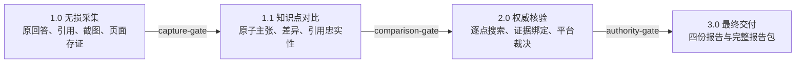

# 全知晓（Fact-Check-X）

[English](README.en.md) · [安全](SECURITY.md) · [隐私](PRIVACY.md) · [贡献](CONTRIBUTING.md) · [发布清单](release/manifest.json)

当前正式版本：[`v1.0.0`](https://github.com/ASI2030/Fact-Check-X/releases/tag/v1.0.0)。唯一正式完整包为 `fact-check-x-complete.zip`，SHA256：

```text
007fe204cddff50a19ecfd1d82e3c0c52c21ef3ff4ee73a45b4e99f5303165b6
```

全知晓（Fact-Check-X）是一套证据优先、可复现、可审计的 Agent Skills。它从用户明确选择的一个或多个 AI 网页端无损采集回答与引用，把回答拆成原子知识点，逐点取得权威证据并完成裁决，最后交付四份相互独立、可追溯的报告。

它解决的不是“再生成一个更像真的答案”，而是让以下关系可以被检查：

- 平台原回答究竟说了什么；
- 每个结论引用了什么，引用是否真的支持该结论；
- 不同平台在哪些原子事实点上一致或冲突；
- 权威材料支持、反驳或暂时无法裁决哪些主张；
- 最终结论如何回到原回答、原引用、权威证据和裁决过程。

> Fact-Check-X 是辅助核验工具，不是政府、司法、医疗、金融或其他专业机构。报告中的事实状态取决于检索时间、地域、来源可得性和用户所选平台。高影响决定必须由具备相应责任和资格的人复核。

## 目录

- [核心能力](#核心能力)
- [四步流程](#四步流程)
- [动态平台数量 N ≥ 1](#动态平台数量-n--1)
- [支持平台](#支持平台)
- [快速开始](#快速开始)
- [安装到不同载体](#安装到不同载体)
- [可信搜索 Key](#可信搜索-key)
- [Playwright 持久会话与 Computer Use 恢复](#playwright-持久会话与-computer-use-恢复)
- [CLI 完整示例](#cli-完整示例)
- [目录与产物契约](#目录与产物契约)
- [配置](#配置)
- [安全与隐私](#安全与隐私)
- [故障排查](#故障排查)
- [验收](#验收)
- [版本与 SHA256 验证](#版本与-sha256-验证)
- [贡献与许可证](#贡献与许可证)

## 核心能力

### 1. 无损采集

- 保留完整原回答，不摘要、不改写、不截断。
- 保留原始 URL、逐句引用标记、全局来源列表、引用正文、截图和页面存证。
- 明确区分“有 URL 的参考文献”和“页面只展示名称的无 URL 来源标签”。
- 等待回答真正停止生成；登录、验证码、区域限制、超时和页面结构变化都是显式失败状态。
- 所选平台未全部成功前，程序门禁阻止后续流程。

### 2. 原子知识点对比

- 将复合回答拆成可独立核验的事实变量。
- 分开记录直接答案与补充参考。
- 保留每个平台的主张、回答片段、所附依据和引用忠实性。
- 不允许跨平台借证，也不允许用回答后段的来源抬高前段主张。
- 本阶段只回答“各家说了什么、依据是否忠实”，不提前替代权威核验。

### 3. 逐点权威核验

- 每个知识点是一个独立请求，可并发取证。
- 可信搜索只返回材料；语义理解、证据判断和裁决由当前宿主智能体完成。
- 合格的深知晓官方锚点可以免重复搜索。
- 无证据、服务异常、证据冲突或裁决结构不完整时进入 `needs_review`，不伪装成完成。

### 4. 可审计报告

- 四个阶段各有独立 HTML 报告。
- 结构化 JSON 与报告数值互相约束。
- 最终压缩包使用相对路径，不包含执行机器的用户路径。
- 完整报告保留来源、时间、知识点、裁决理由、不确定性和失败状态。

## 四步流程



### 第一步：1.0 无损采集

输入是用户原始问题和明确选择的平台集合。输出至少包括：

- `capture/results.json`
- `capture/report.html`
- `capture/report.md`
- `capture/capture-recovery.json`（仅需恢复时）
- `capture-gate.json`
- `01-capture-report.html`

只有 `results.json` 中全部指定平台状态为 `success`、回答非空且恢复状态不再为 `required`，才允许进入 1.1。

### 第二步：1.1 知识点结构化对比

统一入口先生成 `comparison-task.json`。当前宿主智能体阅读任务包，完成语义拆解并写出 `comparison-analysis.json`；脚本负责验证、标准化和渲染。

输出包括：

- `comparison-task.json`
- `comparison-analysis.json`
- `comparison.json`
- `comparison.html`
- `comparison-gate.json`
- `02-comparison-report.html`

1.1 结论仍是“未经过外部权威核验的结构化对比”，不得被描述成最终事实结论。

### 第三步：2.0 云端权威核验

每个知识点独立生成：

- `authority/requests/<知识点ID>.json`
- `authority/evidence/<知识点ID>.json`
- `authority/assessments/<知识点ID>.json`
- `authority/results/<知识点ID>.json`

批次状态保存在 `authority-gate.json`。它必须按 `prepared → searched → finalized` 推进，手工写入文件不能绕过门禁。

完成后生成：

- `verification.json`
- `03-authority-report.html`

### 第四步：3.0 最终裁决与交付

只有权威核验状态为 `completed` 才生成最终定稿：

- `04-final-report.html`
- `pipeline.json`
- `05-complete-report-package.zip`

默认交互模式下，每一步完成后先交付本阶段产物，再让用户选择继续、修正或停止。用户一开始明确要求连续完成时可以自动推进，但登录、验证码、程序门禁和 `needs_review` 仍不能跳过。

## 动态平台数量 N ≥ 1

平台集合由本次用户选择决定，不存在固定“五平台模式”或固定上限。

- `N = 1`：完成单平台无损采集、知识点结构化、权威核验和最终报告；不制造不存在的跨平台差异。
- `N ≥ 2`：在上述流程上增加跨平台一致性、冲突和来源差异对比。
- 报告、门禁、平台卡片、知识点裁决和汇总分母都必须使用本次实际成功的平台集合。
- 任一已选择平台失败时，整个 1.0 阶段失败关闭，不能用部分成功结果进入后续流程。

示例：

```bash
# 单平台
--platform dknowc-chat

# 两个平台
--platform dknowc-chat --platform doubao

# 三个平台，其中深知晓普通回答与深度研究是两个独立结果
--platform dknowc-chat \
--platform dknowc-deep-research \
--platform doubao
```

## 支持平台

平台适配器位于：

`skills/llm-answer-reference-compare/assets/tool/dist/capture/platform-registry.js`

当前注册表包含：

| 平台 ID | 显示名称 | 说明 |
|---|---|---|
| `dknowc-chat` | 深知晓 | 标准问答；合格官方锚点可以进入可信搜索免查判断 |
| `dknowc-deep-research` | 深知晓（深度研究） | 先等待普通回答完整生成，再点击“深度研究”，接管新打开的可信溯源报告页 |
| `doubao` | 豆包 | 网页端回答与来源采集 |
| `deepseek` | DeepSeek | 网页端回答与来源采集 |
| `qianwen` | 通义千问 | 网页端回答与来源采集 |
| `yuanbao` | 腾讯元宝 | 网页端回答与来源采集 |
| `kimi` | Kimi | 网页端回答与来源采集 |
| `chatgpt` | ChatGPT | 网页端回答与来源采集 |
| `claude` | Claude | 网页端回答与来源采集 |
| `gemini` | Gemini | 网页端回答与来源采集 |
| `zhipu` | 智谱 | 网页端回答与来源采集 |

网页结构会变化。注册表存在不等于目标平台永远可用；Release 的支持矩阵和当次 `platforms` 命令输出优先。

### 深知晓（深度研究）的独立语义

`dknowc-deep-research` 不是 `dknowc-chat` 的显示别名，也不是普通页面多等一会：

1. 在同一登录会话提交原问题。
2. 等待普通回答停止生成。
3. 点击回答下方的“深度研究”入口。
4. 接管新打开的可信溯源报告页。
5. 等待深度研究结果停止生成。
6. 独立保存回答、来源、截图和页面存证。

按钮缺失、报告页未打开或结果未完成均为采集失败。它在 `results.json` 和报告中是一个独立平台结果。只有标准 `dknowc-chat` 满足完整锚点条件时才具有后续免重复搜索资格；深度研究结果不能自动继承该资格。

## 快速开始

### 环境要求

- Python 3.10 或更高版本
- Node.js 20 或更高版本
- macOS、Windows 或 Linux
- Google Chrome、Microsoft Edge、Brave 或 Chromium 之一
- 需要在线采集时，拥有所选平台的合法账号和访问权限
- 需要非免查权威核验时，拥有深知 MaaS 的合法访问权限

### 获取 Release

从 [`v1.0.0` Release](https://github.com/ASI2030/Fact-Check-X/releases/tag/v1.0.0) 下载：

- `fact-check-x-complete.zip`：唯一正式完整包，WorkBuddy 和一站式安装首选
- `fact-check-x-suite-v1.0.0.zip`：四个公开独立模块
- 单模块 ZIP：按需安装

完整包 SHA256 必须是 `007fe204cddff50a19ecfd1d82e3c0c52c21ef3ff4ee73a45b4e99f5303165b6`。下载后先按 [版本与 SHA256 验证](#版本与-sha256-验证) 校验，再安装。

### 安装运行依赖

在 `fact-check-x-complete` 技能根目录执行：

```bash
cd modules/llm-answer-reference-compare/assets/tool
npm ci --omit=dev
cd ../../../..
```

正常可见采集优先使用系统 Chromium 浏览器，不要求下载 Playwright 测试浏览器。只有无头或 CI 回归需要时才运行：

```bash
cd modules/llm-answer-reference-compare/assets/tool
npx playwright install chromium
cd ../../../..
```

检查技能定位：

```bash
python3 scripts/fact_check_x.py locate
```

## 安装到不同载体

### WorkBuddy

使用官方技能上传入口：

1. 打开 WorkBuddy 的“技能”。
2. 选择“添加技能”。
3. 选择“上传技能”。
4. 上传已验证的 `fact-check-x-complete.zip`。
5. 查看技能申请的权限和脚本内容后启用。

也可以先让安装脚本验证 ZIP 并输出上传指引：

```bash
python3 scripts/install_skill.py \
  --source fact-check-x-complete.zip \
  --target workbuddy
```

WorkBuddy 官方文档：[技能与本地技能包](https://www.codebuddy.cn/docs/workbuddy/From-Beginner-to-Expert-Guide/Function-Description/Skills-Market)

### CodeBuddy

用户级安装：

```bash
python3 scripts/install_skill.py \
  --source fact-check-x-complete.zip \
  --target codebuddy
```

项目级安装：

```bash
python3 scripts/install_skill.py \
  --source fact-check-x-complete.zip \
  --target codebuddy \
  --project-dir .
```

对应目录分别是 `~/.codebuddy/skills/` 与项目内 `.codebuddy/skills/`。CodeBuddy 会把非内置 Skill 视为不可信来源；启用前应检查 Shell、hooks 和权限。

CodeBuddy 官方文档：[Code Skills](https://www.codebuddy.cn/docs/cli/skills)

### Codex

用户级安装：

```bash
python3 scripts/install_skill.py \
  --source fact-check-x-complete.zip \
  --target codex
```

安装器遵循 `CODEX_HOME`；未设置时使用 `~/.codex/skills/`。安装后重新开始任务或刷新技能列表，让 Codex 重新发现技能。

也可以安装套件中的单模块技能。每个技能目录必须直接包含 `SKILL.md`，不要多套一层无关目录。

OpenAI 参考：[Using skills](https://openai.com/academy/skills/)

### Claude Code

用户级安装：

```bash
python3 scripts/install_skill.py \
  --source fact-check-x-complete.zip \
  --target claude-code
```

项目级安装：

```bash
python3 scripts/install_skill.py \
  --source fact-check-x-complete.zip \
  --target claude-code \
  --project-dir .
```

对应目录分别是 `~/.claude/skills/` 与项目内 `.claude/skills/`。Claude Code 会监视已有技能目录的变化；首次新建顶层技能目录后，必要时重启会话。

Claude Code 官方文档：[Extend Claude with skills](https://code.claude.com/docs/en/slash-commands)

### 安装器的安全行为

- 只接受单根技能 ZIP。
- 拒绝路径穿越、符号链接、`node_modules`、浏览器 profile 和运行结果。
- 目标已存在时默认停止。
- 使用 `--replace` 时，先把旧技能移动到带时间戳的备份，不原地删除。
- `--dry-run` 只显示目标，不写文件。

## 可信搜索 Key

权威核验需要可信搜索，但用户不应把 Key 粘贴到对话、命令历史、Issue 或报告。

### 自动配置

进入权威核验前，程序先检查：

1. 当前进程是否有有效 `TRUSTED_SEARCH_KEY`；
2. 共享凭据文件是否已经存在；
3. 本次知识点是否全部具备合格的深知晓可信锚点。

存在非免查知识点且没有可用 Key 时，`prepare-authority` 返回：

- `status=configuration_required`
- `action=configure_trusted_search`
- `configuration.command`
- 可直接展示给用户的 `userPrompt`

宿主智能体应先提示用户将打开深知 MaaS，然后前台执行返回的命令。标准命令是：

```bash
python3 scripts/trusted_search_config.py configure
```

组件会：

1. 使用包内 Playwright 打开系统浏览器；
2. 等待用户本人完成登录、短信、验证码或人机验证；
3. 自动复用已有完整 Key；
4. 没有可复用 Key 时创建 `Fact-Check-X` 专用 Key；
5. 验证 Key；
6. 保存到 `~/.fact-check-x/credentials/trusted-search-key`；
7. 返回 `configured` 或 `already_configured`。

配置成功后，宿主智能体自动重跑 `prepare-authority`。不得要求用户复制 Key、编辑 shell 配置或在聊天中回复 Key。

### 人工引导

自动配置失败时：

- 保持当前浏览器与前台命令运行；
- 让用户只处理身份验证步骤；
- 不代填账号、密码、短信码或 CAPTCHA；
- 不读取或展示完整 Key；
- 只在 401/403 时把已有 Key 判为失效；
- 超时、断网和服务异常不得擅自删除现有 Key。

检查配置状态，不显示 Key：

```bash
python3 scripts/trusted_search_config.py status
```

清除本机共享 Key：

```bash
python3 scripts/trusted_search_config.py clear
```

清除后，下次非免查权威核验会重新进入自动配置。

## Playwright 持久会话与 Computer Use 恢复

### 持久会话

默认浏览器 profile 位于：

`~/.fact-check-x/browser-profiles`

不同平台使用独立持久化目录。这样可以减少重复登录，但不能跳过：

- 当前载体能力预检；
- 登录入口消失检查；
- 可提问页面确认；
- 回答停止生成检查；
- 所有指定平台成功门禁。

首次使用平台时，应先告诉用户将打开浏览器，然后前台执行：

```bash
node modules/llm-answer-reference-compare/assets/tool/dist/cli.js login \
  --platform doubao \
  --question "$FCX_QUESTION" \
  --out "$FCX_RUN_DIR/capture"
```

`login` 和 `run` 必须前台执行并保留真实退出码。不要加后台符号，不要用会掩盖退出码的管道或容错包装。

### Computer Use 恢复

自动化失败后，采集器写出 `capture-recovery.json`。当其中 `action` 为 `computer_use`：

1. 暂停流水线。
2. 保持原页面和持久化 profile。
3. 有 Computer Use 的宿主接管同一平台页面。
4. 直接复用 `capture-recovery.json.question`。
5. 用户本人处理登录和验证。
6. 等待回答完全停止生成。
7. 重新执行采集并复核 `capture-gate.json`。

禁止用以下动作替代恢复：

- 改用无头浏览器绕过；
- 清理浏览器锁文件；
- 更换另一套临时 profile；
- 修改启动参数碰运气；
- 用已有材料或搜索结果补成“成功”。

宿主没有 Computer Use 时必须明确停在 1.0，不能跳到 1.1。

## CLI 完整示例

以下示例在已安装的 `fact-check-x-complete` 根目录执行。

### 1. 设置本次问题与输出目录

```bash
FCX_QUESTION="某城市现行住房公积金租房提取额度是多少？"
FCX_RUN_DIR="./fact-check-x-run"
```

### 2. 查看平台

```bash
node modules/llm-answer-reference-compare/assets/tool/dist/cli.js platforms
```

### 3. 首次登录

```bash
node modules/llm-answer-reference-compare/assets/tool/dist/cli.js login \
  --platform dknowc-chat \
  --question "$FCX_QUESTION" \
  --out "$FCX_RUN_DIR/capture"

node modules/llm-answer-reference-compare/assets/tool/dist/cli.js login \
  --platform doubao \
  --question "$FCX_QUESTION" \
  --out "$FCX_RUN_DIR/capture"
```

### 4. 采集 N 个平台

```bash
node modules/llm-answer-reference-compare/assets/tool/dist/cli.js run \
  --question "$FCX_QUESTION" \
  --platform dknowc-chat \
  --platform dknowc-deep-research \
  --platform doubao \
  --out "$FCX_RUN_DIR/capture" \
  --headed \
  --interactive \
  --timeout 180000 \
  --retries 2
```

### 5. 生成 1.1 任务

```bash
python3 scripts/fact_check_x.py prepare-comparison \
  --results "$FCX_RUN_DIR/capture/results.json" \
  --run-dir "$FCX_RUN_DIR"
```

当前宿主智能体读取 `comparison-task.json`，完成原子知识点分析并写出 `comparison-analysis.json`，然后：

```bash
python3 scripts/fact_check_x.py complete-comparison \
  --results "$FCX_RUN_DIR/capture/results.json" \
  --run-dir "$FCX_RUN_DIR"
```

### 6. 准备并执行权威搜索

```bash
python3 scripts/fact_check_x.py prepare-authority \
  --run-dir "$FCX_RUN_DIR"
```

若返回 `configuration_required`，先执行返回的 `configuration.command`，成功后重跑上一步。

```bash
python3 scripts/fact_check_x.py search-authority \
  --run-dir "$FCX_RUN_DIR" \
  --max-workers 12
```

当前宿主智能体逐个读取 request 与 evidence，写出 assessment 后：

```bash
python3 scripts/fact_check_x.py finalize-authority \
  --run-dir "$FCX_RUN_DIR"
```

### 7. 生成最终交付

```bash
python3 scripts/fact_check_x.py deliver \
  --results "$FCX_RUN_DIR/capture/results.json" \
  --run-dir "$FCX_RUN_DIR"
```

任一步返回非零状态都应停止并读取结构化错误，不能用后续命令覆盖失败。

## 目录与产物契约

### 仓库目录

```text
Fact-Check-X/
├── README.md
├── README.en.md
├── LICENSE
├── NOTICE
├── THIRD_PARTY_NOTICES.md
├── TRADEMARKS.md
├── SECURITY.md
├── PRIVACY.md
├── CONTRIBUTING.md
├── skills/
│   ├── fact-check-x-complete/
│   ├── fact-check-x-unified/
│   ├── fact-check-x-authoritative-verify/
│   ├── fact-check-x-knowledge-compare/
│   └── llm-answer-reference-compare/
├── scripts/
│   ├── audit_public_tree.py
│   ├── build_release.py
│   ├── install_skill.py
│   └── verify_release.py
├── release/
│   ├── manifest.json
│   └── public-file-allowlist.txt
└── tests/
```

### 技能分工

| 目录 | 职责 |
|---|---|
| `fact-check-x-complete` | WorkBuddy 等载体的一站式入口和产品门禁 |
| `llm-answer-reference-compare` | 1.0 多端回答、引用与现场存证采集 |
| `fact-check-x-knowledge-compare` | 1.1 原子知识点与引用忠实性对比 |
| `fact-check-x-authoritative-verify` | 逐知识点权威取证、裁决与 V8 报告 |
| `fact-check-x-unified` | 跨模块定位、编排、门禁与交付 |

### 单次运行目录

```text
fact-check-x-run/
├── capture/
│   ├── results.json
│   ├── report.html
│   ├── report.md
│   └── artifacts/
├── capture-gate.json
├── comparison-task.json
├── comparison-analysis.json
├── comparison.json
├── comparison.html
├── comparison-gate.json
├── authority/
│   ├── requests/
│   ├── evidence/
│   ├── assessments/
│   ├── results/
│   └── batch.json
├── authority-gate.json
├── verification.json
├── pipeline.json
├── 01-capture-report.html
├── 02-comparison-report.html
├── 03-authority-report.html
├── 04-final-report.html
└── 05-complete-report-package.zip
```

### 不变量

- 1.0 不改写原回答，不替换平台原引用。
- 1.1 不联网找最终真相。
- 权威层一次只处理一个知识点。
- 所有平台主张必须绑定当前知识点的真实证据 ID。
- `supported` 和 `contradicted` 必须引用当前证据包中存在的证据。
- `no_evidence` 进入待复核，不自动等于编造。
- 四份阶段报告缺少任一项时，不生成完整报告包。
- 完整报告包只包含相对路径。

## 配置

| 配置 | 默认值 | 用途 |
|---|---|---|
| `FACTCHECK_SKILLS_DIR` | 自动定位相邻技能或已安装目录 | 覆盖四模块父目录 |
| `FACT_CHECK_X_BROWSER_EXECUTABLE` | 自动选择系统 Chromium 浏览器 | 指定浏览器可执行文件 |
| `FACTCHECK_BROWSER_PROFILE_DIR` | `~/.fact-check-x/browser-profiles` | 覆盖持久化 profile 根目录 |
| `FACT_CHECK_X_TRUSTED_SEARCH_KEY_FILE` | `~/.fact-check-x/credentials/trusted-search-key` | 覆盖共享 Key 文件位置 |
| `TRUSTED_SEARCH_KEY` | 未设置 | 仅用于受控进程注入，不建议写入 shell 历史 |
| `FACTCHECK_TRUSTED_SEARCH_URL` | 官方可信搜索端点 | 受控环境覆盖端点 |
| `FACTCHECK_TRUSTED_SEARCH_TIMEOUT_SECONDS` | 90 秒 | 权威搜索超时，范围受程序限制 |
| `CI` | 未设置 | 在 CI 中选择测试浏览器行为 |

配置优先级、可用性检查和失败语义以对应 Release 中的代码为准。

## 安全与隐私

安装第三方 Skill 等于允许宿主智能体读取指令并执行其中的脚本。启用前：

1. 验证 Release SHA256 和不可变状态。
2. 阅读 `SKILL.md`、脚本和权限。
3. 只启用当前任务需要的平台。
4. 使用测试账号完成首次验证。
5. 不把密码、验证码、Cookie 或 Key 发送给智能体。

Fact-Check-X 的默认边界：

- 不调用外部模型 API；
- 只把问题提交给用户明确选择的网页平台；
- 只把单个知识点提交给可信搜索；
- 浏览器状态和 Key 保存在本机用户目录；
- 源码与 Release 不包含 profile、Cookie、Key、真实会话和真实报告；
- 不添加遥测；
- 第三方网站仍可能依据其自身条款记录请求与账号活动。

详情见 [PRIVACY.md](PRIVACY.md) 和 [SECURITY.md](SECURITY.md)。

## 故障排查

| 现象 | 先看什么 | 正确处理 |
|---|---|---|
| `locate` 找不到模块 | `FACTCHECK_SKILLS_DIR`、安装层级、完整包根目录 | 修正技能父目录；不要复制成多层同名目录 |
| `npm ci` 失败 | Node 版本、网络、锁文件完整性、npm registry | 使用 Node 20+；保留 lock integrity；不要提交 `node_modules` |
| 浏览器没有打开 | 前台命令真实退出码、系统 Chromium、`FACT_CHECK_X_BROWSER_EXECUTABLE` | 按错误处理；不要先声称浏览器已启动 |
| 页面有输入框但仍未登录 | 页面登录入口是否仍存在 | 等用户完成登录，禁止提前提交问题 |
| 验证码/CAPTCHA | 当前前台命令和页面 | 保持页面，交给用户本人处理 |
| 回答采集不完整 | 页面是否仍在生成、来源计数是否达到页面声明 | 等待稳定；失败后自动重采 |
| 生成 `capture-recovery.json` | `action`、平台、问题、profile | 有 Computer Use 时接管同一页面；没有时停在 1.0 |
| 一个平台失败 | `capture-gate.json` | 重采或恢复该平台；不能用部分成功继续 |
| `configuration_required` | `configuration.command` 与 `userPrompt` | 前台运行自动配置；不要让用户粘贴 Key |
| 可信搜索 401/403 | Key 状态 | 重新自动配置 |
| 可信搜索超时/断网 | 服务状态与网络 | 保留现有 Key，进入待复核；不要清除凭据 |
| `needs_review` | 缺证、冲突、assessment 结构、证据 ID | 补证或修正结构；不得宣称完成 |
| `deliver` 被拒绝 | 三道 gate、四份阶段报告 | 从最后一个合法状态修复，不手工改 gate |
| 本机链接无法分享 | 产物仍是本地路径 | 上传完整报告包或阶段报告附件 |
| 已安装技能未触发 | 技能目录、`SKILL.md` frontmatter、载体重载 | 重新发现技能并用明确任务触发 |

## 验收

### 公开边界审计

```bash
python3 scripts/audit_public_tree.py
```

必须返回 `status=passed`，且 `findings=[]`。

### 公共发布工具测试

```bash
python3 -m unittest discover -s tests -p 'test_*.py'
```

该测试会验证：

- 公开树无禁止文件和敏感内容；
- Release 两次构建字节一致；
- 每个资产与 manifest 的 SHA、大小、ZIP 根和法务文件一致；
- 安装器 dry run 不写安装态；
- 源 manifest 绑定 `v1.0.0`、正式完整包 SHA 与正式回执 SHA。

### 技能 Smoke Tests

```bash
python3 skills/llm-answer-reference-compare/tests/smoke_test.py
python3 skills/fact-check-x-knowledge-compare/tests/smoke_test.py
python3 skills/fact-check-x-authoritative-verify/tests/smoke_test.py
python3 skills/fact-check-x-unified/tests/smoke_test.py
python3 skills/fact-check-x-complete/tests/smoke_test.py
```

### 关键 Node.js 回归

先在采集运行时目录执行 `npm ci --omit=dev`，然后：

```bash
node skills/llm-answer-reference-compare/tests/artifact_path_test.mjs
node skills/llm-answer-reference-compare/tests/login_recovery_test.mjs
node skills/llm-answer-reference-compare/tests/deep_research_test.mjs
node skills/llm-answer-reference-compare/tests/trusted_search_onboarding_test.mjs
```

浏览器在线验收必须使用受权测试账号，测试结果和 profile 不得提交到仓库。

### 构建并验证公共资产

```bash
FCX_RELEASE_OUT="./release-assets"

python3 scripts/build_release.py \
  --out-dir "$FCX_RELEASE_OUT" \
  --version 1.0.0 \
  --upstream-candidate-sha 007fe204cddff50a19ecfd1d82e3c0c52c21ef3ff4ee73a45b4e99f5303165b6 \
  --official-complete-sha 007fe204cddff50a19ecfd1d82e3c0c52c21ef3ff4ee73a45b4e99f5303165b6

python3 scripts/verify_release.py manifest \
  --manifest "$FCX_RELEASE_OUT/release-manifest.json" \
  --asset-dir "$FCX_RELEASE_OUT"
```

`v1.0.0` 的正式回执 SHA 为 `317a6dc7b65a4020da252a08054b5a62a74001e088226722071232619ec857ea`。后续版本若缺少正式 SHA，构建状态只能是 `awaiting_promote`；候选 SHA 与正式 SHA 不一致时，构建器直接失败。

## 版本与 SHA256 验证

### 验证主任务正式包

验证 `v1.0.0` 唯一正式完整包：

```bash
python3 scripts/verify_release.py sha \
  --file fact-check-x-complete.zip \
  --sha256 007fe204cddff50a19ecfd1d82e3c0c52c21ef3ff4ee73a45b4e99f5303165b6
```

该 SHA 已由正式回执 `317a6dc7b65a4020da252a08054b5a62a74001e088226722071232619ec857ea` 绑定为正式发布基线。

### 验证公开 Release

下载 Release 资产和 `release-manifest.json` 到同一目录：

```bash
python3 scripts/verify_release.py manifest \
  --manifest release-manifest.json \
  --asset-dir .
```

也可以使用系统命令：

macOS：

```bash
shasum -a 256 fact-check-x-complete.zip
```

Linux：

```bash
sha256sum fact-check-x-complete.zip
```

Windows PowerShell：

```powershell
Get-FileHash .\fact-check-x-complete.zip -Algorithm SHA256
```

启用 GitHub 不可变 Release 后：

```bash
gh release verify v1.0.0 --repo ASI2030/Fact-Check-X
gh release verify-asset v1.0.0 fact-check-x-complete.zip \
  --repo ASI2030/Fact-Check-X
gh attestation verify fact-check-x-complete.zip \
  --repo ASI2030/Fact-Check-X
```

`fact-check-x-complete.zip` 是正式安装基线；带版本号的模块和套件 ZIP 是从同一公开源码树确定性构建的分发资产，具有各自独立 SHA。`release-manifest.json` 同时记录正式输入与公开构建资产，不能混用哈希。

## 贡献与许可证

原创代码和文档采用 [Apache License 2.0](LICENSE)。`llm-answer-reference-compare` 运行时原有 MIT 许可证继续保留。完整归属见 [THIRD_PARTY_NOTICES.md](THIRD_PARTY_NOTICES.md)。

Apache-2.0 不授予项目品牌或第三方商标使用权，见 [TRADEMARKS.md](TRADEMARKS.md)。

提交贡献前请阅读 [CONTRIBUTING.md](CONTRIBUTING.md)。公开 Issue、PR、测试夹具和截图只能使用合成或已获明确授权的数据。
